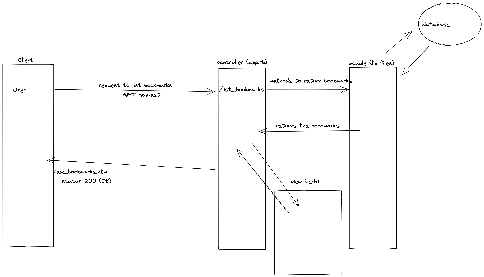

# Bookmark manager

This app allows users to add, delete and manage a series of bookmarks.
It's built with Sinatra and it uses a PostgreSQL database to store data.

# Database set-up

1. Install PostgreSQL: `brew install psql`
2. Run `psql`
3. Create a Bookmarks database: `CREATE DATABASE bookmark_manager;`
4. Connect to the database: `\c bookmark_manager;`
5. Run the SQL query in [`/db/migrations/`](./db/migrations/01_create_bookmarks_table.sql) to create a table.

# Test Database set-up

1. Run `psql`
2. Create a Test database: `CREATE DATABASE bookmark_manager_test;`
3. Connect to the database: `\c bookmark_manager_test;`
4. Run the SQL query in [`/db/migrations/`](./db/migrations/01_create_bookmarks_table.sql) to create a table.

# User stories

## User story one

As a user\
So that I can see a bookmark\
I would like the app to show a list of bookmarks when I ask it to.

